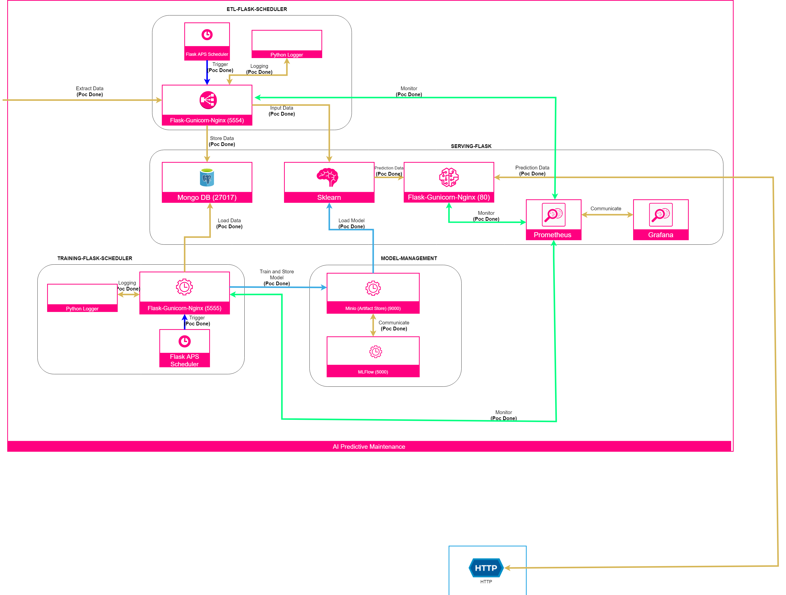

# ml-pipeline-architecture-template
ML Architecture Template Demo, using Flask-Gunicorn-Nginx, Mongo DB, MLflow, Prometheus, Grafana

<br>

## Overview



<br>

- This repo consists of 3 docker-compose apps related to architecture image above.

- ```serving-flask``` refer to SERVING-FLASK APPS. When this apps started (in this repo), it will generate dummy data to Mongo DB (Port: 27017) to used for Model Training. There are another Rest API(s) in the apps too. Prometheus will scrap the relevant data from the apps. Further explanation in separate readme.

- ```etl-flask-scheduler``` refer to ETL-FLASK-SCHEDULER APPS. When this apps started (in this repo), it will scheduled every 5 minutes (can be changed via code or API) to generate random data, then push the data to Mongo DB (Port 27017) and also pass the data to ```serving-flask``` via API so that new data will be predicted. There are another Rest API(s) in the apps too. Prometheus will scrap the relevant data from the apps. Further explanation in separate readme. 

- ```training-flask-scheduler``` refer to TRAINING-FLASK-SCHEDULER APPS. When this apps started (in this repo), it will scheduled every 1 hours (can be changed via code or API) to train model with data from Mongo DB (Port 27017) or via static file if there is connection error, then log the result to MLFlow (Port:5000) and store the Model to Minio (Port : 9000). There are another Rest API(s) in the apps too. Prometheus will scrap the relevant data from the apps. Further explanation in separate readme.

- https://github.com/sachua/mlflow-docker-compose refer to MODEL-MANAGEMENT APPS.

- all of the apps can be deployed in inside 1 docker-compose to become more compact version.

<br>

## Requirements

- docker.
- docker-compose.
- host with open port as listed on the image (port can be changed, but needed to change the docker-compose file later).
- free disk space for docker images at least 10 GB.

<br>

## Quickstart

### Install MLFlow and Minio
- Follow the steps on https://github.com/sachua/mlflow-docker-compose first (no need to follow Example Section), make sure minio installed on port 9000 and MLFlow installed on port 5000.
- go to ```localhost:5000``` then tab Models, then create Model named `sk-learn-linear-reg-model`.

### Install Serving-Flask Apps
- change directory to `serving-flask` with ```cd serving-flask```.
- create `.env` file and set the correct environment variables, for secret env variables please refer to Secret Environment Variables section.
- ```docker-compose up -d --build```.
- make sure all images run successfully.

### Install Training-Flask-Scheduler Apps
- change directory to `training-flask-scheduler` with ```cd ..``` then ```cd training-flask-scheduler```.
- create `.env` file and set the correct environment variables, for secret env variables please refer to Secret Environment Variables section.
- ```docker-compose up -d --build```.
- make sure all images run successfully.

### Install ETL-Flask-Scheduler Apps
- change directory to `etl-flask-scheduler` with ```cd ..``` then ```cd etl-flask-scheduler```.
- create `.env` file and set the correct environment variables, for secret env variables please refer to Secret Environment Variables section.
- ```docker-compose up -d --build```.
- make sure all images run successfully

### Fast Checking
- with Postman or another relevant apps: 
    - Check on ```127.0.0.1:80/getLatestData/``` to get the latest data generated in Mongo DB (Port:27017).
    - Check on ```127.0.0.1:5555/manualTraining/``` to perform manual training, if return success then there's should be new experiment finished in ```localhost:5000```.

<br>

## Secret Environment Variables

 key | value explanation
---|--- 
 MONGO_INITDB_ROOT_USERNAME | username for MongoDB (port:27017), can be anything for example "admin"
 MONGO_INITDB_ROOT_PASSWORD | password for MongoDB (port:27017), can be anything for example "Password"
 USERNAMEDBEXT | username for MongoDB (port:27017) same as MONGO_INITDB_ROOT_USERNAME
 PASSWORDDBEXT | password for MongoDB (port:27017) same as MONGO_INITDB_ROOT_PASSWORD
 AWS_ACCESS_KEY_ID | username needed to login to `localhost:9000`, if follow the https://github.com/sachua/mlflow-docker-compose without any changes the it will be "minio" (Not recommended for production use).
 AWS_SECRET_ACCESS_KEY | password needed to login to `localhost:9000`, if follow the https://github.com/sachua/mlflow-docker-compose without any changes the it will be "minio123" (Not recommended for production use).
 MLFLOW_TRACKING_URI | MLFLOW address, if docker can connect to localhost via host.docker.internal then default "http://host.docker.internal:5000", if no then can use docker network or IP Address.
 MLFLOW_S3_ENDPOINT_URL | MINIO address, if docker can connect to localhost via host.docker.internal then default "http://host.docker.internal:9000", if no then can use docker network or IP Address.

<br>

## Additional Information

### Logging

- each of the apps (```etl-flask scheduler```, ```serving-flask```, ```training-flask-scheduler```) already implemented with Python Logger.
- logging files can be found in each of directory ```app/logs.log```.
- logging format and config can be changed in ```app/config/logging_config.yaml``` and ```app/utils/logger.py```.

### Prometheus

- each of the apps (```etl-flask scheduler```, ```serving-flask```, ```training-flask-scheduler```) already implemented with Prometheus with name :
    - `request_etl_process_latency_second`
    - `request_etl_process_error`
    - `request_training_process_latency_second`
    - `request_training_process_error`
    - `request_prediction_dummy`
    - `request_count`
    - `request_etl_count`
    - `request_training_count`
    - `request_latency_seconds`
    - `request_etl_latency_seconds`
    - `request_training_latency_seconds`
- each of prometheus format can be changed from ```app/middleware.py``` and ```app/prometheus.py``` and directly implement in ```app/main.py```. 
